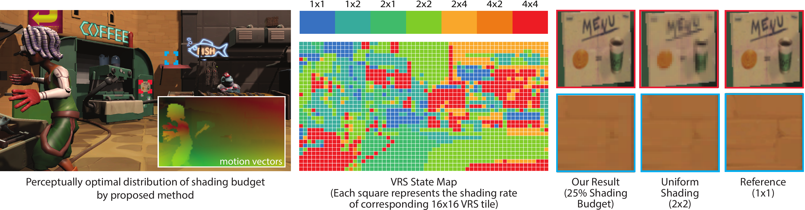

# ALSaRR: Perceptual Model for Adaptive Local Shading and Refresh Rate

</img>

This repository contains the VRS motion quality dataset, source code for CaMoJAB metric and ALSaRR method described in our SIGGRAPH paper:

Akshay Jindal, Krzysztof Wolski, Karol Myszkowski and Rafał K. Mantiuk. 2021. Perceptual Model for Adaptive Local Shading and Refresh Rate. ACM Trans. Graph. (Proc. of SIGGRAPH Asia 2021), 40, 6, Article 280 (December 2021), 18 pages. https://doi.org/10.1145/3478513.3480514

The paper and videos can be found on the project web page: https://www.cl.cam.ac.uk/research/rainbow/projects/alsarr/

Repository structure (see individual file for usage and dependencies):  

CaMoJAB/  
<table><thead><tr><th>File</th><th>Description</th></tr></thead><tbody><tr><td>camojab.m</td><td>content-aware motion quality metric</td></tr><tr><td>camojab_fits.mat</td><td>prefitted metric parameters</td></tr><tr><td>model_Dst.m</td><td>core logic of camojab metric</td></tr><tr><td>sample_texture.png</td><td>Sample image for example</td></tr><tr><td>example.m</td><td>example usage of camojab metric</td></tr><tr><td>fits/train_camojab.m</td><td>Paper Figure 7(a-b)</td></tr><tr><td>fits/test_camojab.m</td><td>Paper Figure 7(c)</td></tr><tr><td>fits/ablation_camojab.m</td><td>Supplementary Table 1</td></tr><tr><td>paper_plots/plot_luminance_vs_persistence.m</td><td>Paper Figure 9</td></tr><tr><td>paper_plots/plot_ppd_vs_fps_vs_vel.m</td><td>Paper Figure 8(b)</td></tr><tr><td>paper_plots/plot_ppd_vs_vel_vs_fps.m</td><td>Paper Figure 8(a)</td></tr></tbody></table>

  
ALSaRR/  
<table><thead><tr><th>File</th><th>Description</th></tr></thead><tbody><tr><td>adaptive_fps.m</td><td>(example) calculate optimal fps vs vel LUT</td></tr><tr><td>adaptive_vrs.m</td><td>(example) calculate optimal VRS map</td></tr><tr><td>vrs_dp.m</td><td>optimal solution to VRS knapsack problem</td></tr><tr><td>vrs_greedy.m</td><td>near optimal solution to VRS knapsack problem</td></tr><tr><td>polyfit_quality.m</td><td>(example) how to fit polynomial to camojab</td></tr><tr><td>sample_data/</td><td>sample data for above scripts</td></tr></tbody></table>

  
Experiment_data/
  
<table><thead><tr><th>File</th><th>Description</th></tr></thead><tbody><tr><td>vrs_exp_data.csv</td><td>Pairwise comparision data from Experiment 1</td></tr><tr><td>scale_pwc2jnd.m</td><td>Script to scale data to JND units</td></tr><tr><td>vrs_exp_data_jnd.mat</td><td>PWC data scaled to JND</td></tr><tr><td>vrs_exp_stimulus.mat</td><td>Textures used in the experiment</td></tr><tr><td>alsarr_validation_experiment.csv</td><td>Validation experiment results</td></tr><tr><td>external_data/marrr_exp1_jnds.mat</td><td>Data from [Denes et al. 2020] Experiment 1</td></tr><tr><td>external_data/marrr_exp3_jnds.mat</td><td>Data from [Denes et al. 2020] Experiment 3</td></tr></tbody></table>
 
  
Utils/: collection of  helper functions   

